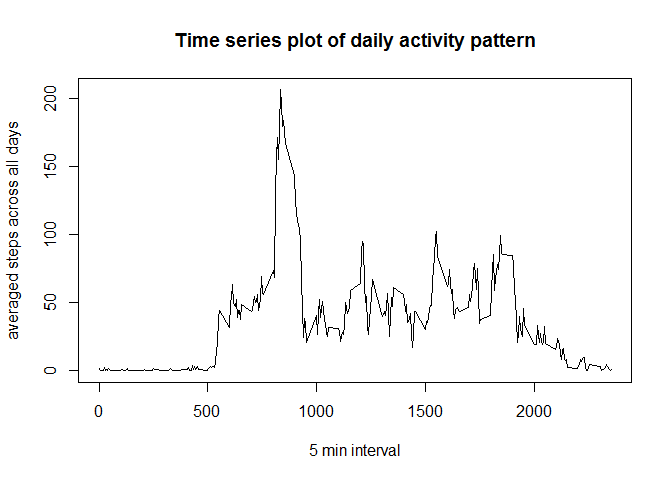
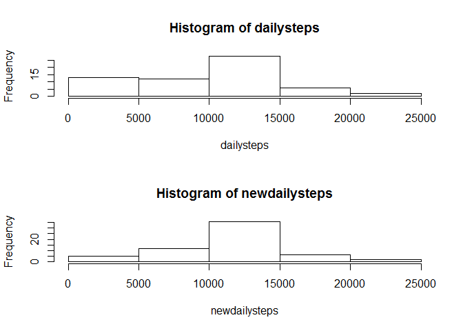

# Reproducible Research: Peer Assessment 1

## 0.Setting Work directory

Use setwd to indicate R to the folder of the dataset.

## Loading and preprocessing the data


```r
rawdata<-read.csv("activity.csv", header=TRUE)
str(rawdata)
```

```
## 'data.frame':	17568 obs. of  3 variables:
##  $ steps   : int  NA NA NA NA NA NA NA NA NA NA ...
##  $ date    : Factor w/ 61 levels "2012-10-01","2012-10-02",..: 1 1 1 1 1 1 1 1 1 1 ...
##  $ interval: int  0 5 10 15 20 25 30 35 40 45 ...
```

```r
rawdata[,2]<-as.Date(rawdata$date)
str(rawdata$date)
```

```
##  Date[1:17568], format: "2012-10-01" "2012-10-01" "2012-10-01" "2012-10-01" ...
```

Load the raw dataset from csv file, and figure out that date column read as the factor. In order to make the analysis of the daily steps, conver the date column from factor to date.


## What is mean total number of steps taken per day?


### 1).Calculate the total number of steps per day.

```r
firstday<-min(rawdata$date)
lastday<-max(rawdata$date)
dailysteps<-c()
date<-c()
for (x in firstday:lastday){
        day.sub<-subset(rawdata, date==as.character(as.Date.numeric(x,origin = "1970-01-01")))
        steps<-sum(day.sub$steps, na.rm=TRUE)
        dailysteps<-c(dailysteps,steps)
        date<-c(date,x)
}
str(date)
```

```
##  int [1:61] 15614 15615 15616 15617 15618 15619 15620 15621 15622 15623 ...
```

```r
head(data.frame(cbind(date,dailysteps)))
```

```
##    date dailysteps
## 1 15614          0
## 2 15615        126
## 3 15616      11352
## 4 15617      12116
## 5 15618      13294
## 6 15619      15420
```
Use a loop to sum the dailysteps of everyday. The x in the loop was a numeric value. The date value actrually only equal to its same characteristic value. In order to catch the subset of everyday, transform the x to a characteristic value is necessary. Same situation to the convert the numeric value to date in the final result data frame.

```r
date<-as.character(as.Date.numeric(date, origin="1970-01-01"))
str(date)
```

```
##  chr [1:61] "2012-10-01" "2012-10-02" "2012-10-03" ...
```

```r
stepsperday<-data.frame(cbind(date,dailysteps),stringsAsFactors = F)
stepsperday$dailysteps<-dailysteps
```
The date 1970-01-01 is the original date to transform from numeric value to date format. The result of total daily steps are showing below, and make sure first column is Characteristics and second column is numeric:

```r
head(stepsperday)
```

```
##         date dailysteps
## 1 2012-10-01          0
## 2 2012-10-02        126
## 3 2012-10-03      11352
## 4 2012-10-04      12116
## 5 2012-10-05      13294
## 6 2012-10-06      15420
```

### 2).The histogram of the total number of steps taken each day

```r
hist(dailysteps)
```

<!-- -->

### 3).The mean and median of the total number of steps taken each day

```r
summary(dailysteps)
```

```
##    Min. 1st Qu.  Median    Mean 3rd Qu.    Max. 
##       0    6778   10400    9354   12810   21190
```

## What is the average daily activity pattern?

### 1).Make a time series plot (i.e. type = "l") of the 5-minute interval (x-axis) and the average number of steps taken, averaged across all days (y-axis)

```r
interval<-rawdata$interval[!duplicated(rawdata$interval)]
```
create a vector called interval to store the all the interval values.

```r
steps<-c()
for (i in interval){
        int.sub<-subset(rawdata,interval==i)
        int.avg<-mean(int.sub$steps, na.rm=TRUE)
        steps<-c(steps,int.avg)
}
avgintsteps<-data.frame(cbind(interval,steps),stringsAsFactors = F)
```
create a dataset of all intervals and their average steps, called avgintsteps, the dataset showing below:

```
##   interval     steps
## 1        0 1.7169811
## 2        5 0.3396226
## 3       10 0.1320755
## 4       15 0.1509434
## 5       20 0.0754717
## 6       25 2.0943396
```
Make a time series plot:

```r
plot(avgintsteps$interval,avgintsteps$steps,type="l",main="Time series plot of daily activity pattern",xlab="5 min interval", ylab="averaged steps across all days")
```

<!-- -->

### 2). The 5 min interval contains the Maximum number of steps

```r
subset(avgintsteps,steps==max(avgintsteps$steps))
```

```
##     interval    steps
## 104      835 206.1698
```


## Imputing missing values

### 1).Calculate and report the total number of missing values in the dataset (i.e. the total number of rows with NAs)

```r
missN<-sum(is.na(rawdata$steps))
```
so there are 2304 missing values in dataset.

### 2).Devise a strategy for filling in all of the missing values in the dataset. The strategy does not need to be sophisticated. I will use the mean for that 5-minute interval, etc.

```r
colnames(avgintsteps)<-c("interval","avgsteps")
avgrawdata<-merge(rawdata,avgintsteps,by = "interval")
nullsteps<-c()
for (i in 1:nrow(avgrawdata)){
        if (is.na(avgrawdata$steps[i])) {
                avgrawdata$steps[i]<-avgrawdata$avgsteps[i]
        }
}
```

### 3).Create a new dataset that is equal to the original dataset but with the missing data filled in.

```r
newdataset<-avgrawdata[,c(1,2,3)]
head(newdataset)
```

```
##   interval    steps       date
## 1        0 1.716981 2012-10-01
## 2        0 0.000000 2012-11-23
## 3        0 0.000000 2012-10-28
## 4        0 0.000000 2012-11-06
## 5        0 0.000000 2012-11-24
## 6        0 0.000000 2012-11-15
```

### 4).Make a histogram of the total number of steps taken each day and Calculate and report the mean and median total number of steps taken per day. Do these values differ from the estimates from the first part of the assignment? What is the impact of imputing missing data on the estimates of the total daily number of steps?

```r
newdailysteps<-c()
for (x in firstday:lastday){
        day.sub<-subset(newdataset, date==as.character(as.Date.numeric(x,origin = "1970-01-01")))
        steps<-sum(day.sub$steps, na.rm=TRUE)
        newdailysteps<-c(newdailysteps,steps)
}
hist(newdailysteps)
```

<!-- -->

And Compare the hisograms from question one and this question.

```r
par(mfrow=c(2,1))
hist(dailysteps)
hist(newdailysteps)
```

<!-- -->

summary of the new data set showing below:

```r
summary(newdailysteps)
```

```
##    Min. 1st Qu.  Median    Mean 3rd Qu.    Max. 
##      41    9819   10770   10770   12810   21190
```

Compare the mean and median of two dataset:

```r
if (mean(dailysteps)==mean(newdailysteps)) print("The means daily steps of two datasets are equal") else{
        if (mean(dailysteps)<mean(newdailysteps)) 
                print("The mean daily steps of raw datasets is less than that of new dataset") 
        else 
                print("The mean daily steps of raw dataset is more than that of new dataset")
}
```

```
## [1] "The mean daily steps of raw datasets is less than that of new dataset"
```

```r
if (median(dailysteps)==median(newdailysteps)) print("The median daily steps of two datasets are equal") else{
        if (median(dailysteps)<median(newdailysteps)) 
                print("The median daily steps of raw dataset is less than that of new dataset") 
        else 
                print("The median daily steps of raw dataset is more than that of new dataset")
}
```

```
## [1] "The median daily steps of raw dataset is less than that of new dataset"
```
The reason to make this kind of result is that I use the interval averaged steps to fill in the NAs, so make the steps of everyday increasing.

## Are there differences in activity patterns between weekdays and weekends?

### 1).Create a new factor variable in the dataset with two levels - "weekday" and "weekend" indicating whether a given date is a weekday or weekend day.

```r
newdataset$wd<-weekdays(newdataset$date)
for (i in c(1:nrow(newdataset))){
        if (newdataset$wd[i] %in% c("Sunday","Saturday")){
                newdataset$day[i]<-c("weekend")
        } else {
                newdataset$day[i]<-c("weekday")
        }
}
newdataset$day<-as.factor(newdataset$day)
```

The factor I created and named it as day and put it as a column in the data set.

```r
head(newdataset)
```

```
##   interval    steps       date       wd     day
## 1        0 1.716981 2012-10-01   Monday weekday
## 2        0 0.000000 2012-11-23   Friday weekday
## 3        0 0.000000 2012-10-28   Sunday weekend
## 4        0 0.000000 2012-11-06  Tuesday weekday
## 5        0 0.000000 2012-11-24 Saturday weekend
## 6        0 0.000000 2012-11-15 Thursday weekday
```

### 2).Make a panel plot containing a time series plot (i.e. type = "l") of the 5-minute interval (x-axis) and the average number of steps taken, averaged across all weekday days or weekend days (y-axis). The plot should look something like the following, which was created using simulated data:

First make a new dataset have the inverval averaged steps for weekend and weekdays.

```r
wdds<-subset(newdataset,day=="weekday")
weds<-subset(newdataset,day=="weekend")
wdavg<-c()
for (i in interval) {
        sub.int<-subset(wdds,interval==i)
        avg.int<-mean(sub.int$steps)
        wdavg<-c(wdavg,avg.int)
}
weavg<-c()
for (i in interval) {
        sub.int<-subset(weds,interval==i)
        avg.int<-mean(sub.int$steps)
        weavg<-c(weavg,avg.int)
}
avg<-c(wdavg,weavg)
intv<-c(interval,interval)
days<-as.factor(c(rep("weekday",length(interval)),
        rep("weekend",length(interval))))
avgintdays<-data.frame(cbind(avg,intv))
avgintdays$days<-days
```

Plot the time series plot by lattice package.If did not installed lattice package, can use following script in R to isntall it.

```r
install.packages("lattice")
```

The time series plots:

```r
library(lattice)
xyplot(avg~intv|days,data=avgintdays,
       type="l",
       xlab = "Interval",
       ylab = "Number of Steps",
       layout = c(1,2))
```

<!-- -->

